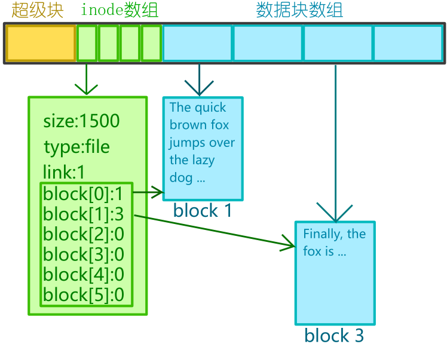

# 青春版EXT2文件系统

## 简述
* 参考EXT2文件系统的结构设计，实现精简版的文件管理系统，基本功能包括创建文件touch和文件夹mkdir，读取文件夹内容ls以及复制文件copy，最后关闭文件系统，下次打开还能恢复上次的状态

* 文件系统可管理4MB大小的磁盘空间, 物理上划分成8192个磁盘块，每块512B，文件块为1KB两个磁盘块；
* 逻辑上分两个部分, 第一个部分存放文件系统管理必须的**数据结构**，包括超级块super block，索引节点表inode table，其中超级块使用位图法表示文件块、索引节点的占用情况；第二部分则为存放文件内容的数据块。
  ```c++
  typedef unsigned int uint32_t;
  typedef int int32_t;
  typedef unsigned short uint16_t;
  typedef unsigned char uint8_t;
  typedef struct super_block{
      int32_t magic_number;         // 幻数，用于识别文件系统
      int32_t free_block_num;       // 空闲文件块数
      int32_t free_inode_num;       // 空闲索引节点数
      uint32_t inode_map[32];       // 索引节点占用位图
      uint32_t flblk_map[128];      // 文件块占用位图
  }spBlock;
  // 4+4+4+32*4+128*4 = 656B(单独一个blk)
  ```


* 一个文件对应一个inode和几个保存文件内容的数据块，其中inode节点存放文件大小(B)、文件类型(dir or file)与文件块指针(blk[6], 直接索引)、连接数(link，保留):
    ```c++
    typedef struct inode{
        uint32_t size;      //文件大小(B)
        uint16_t type;      //0:dir; 1:file
        uint32_t link;
        uint32_t blk[6];    //最大6KB
    }inode;
    // 4+2+2+24 = 32B
    ```


* 与文件一样，一个目录也对应一个inode和几个保存目录结构的数据块，此时数据块里保存的是一个个的**目录项**, 用结构体dirent表示，dirent下存放文件名、索引节点号、有效位以及文件类型:
    ```C++
    typedef struct dirent{
        char name[121];         //文件\目录名
        uint32_t inode_id;      //索引节点号
        uint16_t type;          //文件类型
        uint8_t valid;          //是否有效
    }dirent;
    ```
## 数据结构示意图

<br/>

## 文件系统初始化
* 读取超级块，检查幻数是否一致，初次进入一般与用户自定义的幻数不一致
* 不一致时需要初始化超级块（清空文件系统）:
  1. 指定一个幻数，如0x20220315
  2. 计算空闲文件块数目，4096-1-32-1
  3. 计算空闲索引节点数，1024-1(根目录的索引节点号设为0号)
  4. 依据2和3初始化索引节点位图和数据块位图
* 再次进入文件系统时，若幻数一致，则保留上次的状态

## 部分功能实现

### ls - 列出指定目录下的文件
* 当前目录为根目录，需要列出指定文件夹下的文件以及文件夹，例如ls home列出了home文件夹中文件以及文件夹的情况
* 以ls home为例，首先依据编号0找到根目录的inode索引节点，遍历blk[]数组中存放的数据块指针，对于每一个指针，找到对应数据块，遍历其中存放的dirent数据结构，按名查找，若匹配则保存该dirent中的inode_id, 否则打印出错信息
* 若为多级目录，则在找到对应dirent中的inode_id后重复刚才的过程，直到最后一级目录

* 在得到最后一级目录的inode_id后，遍历数据块中的dirent，打印有效dirent的文件/目录信息

### mkdir - 创建文件夹
* 以mkdir tstdir为例，读取根目录索引节点(0号)，依据数据块指针按dirent结构遍历数据块，遍历时检查每个有效dirent的name是否与tstdir相同且为文件夹，如果有重名，则创建失败，否则继续查找直到找到空闲dirent t，如果数据块均已装满(6KB/128B=48)，则创建失败;
* 若查找到空闲dirent t, 读取super block, 检索inode_map获取空闲索引节点idex，若未找到则创建失败;
* 设置t的name为tstdir，t的有效位为1，inode_id为index；
* 如果是多级文件夹，则应按照类似ls的步骤找到待创建文件夹的父文件夹，再从mkdir的第一步开始进行。

### touch - 创建文件
* 实质与mkdir类似

### cp - 复制文件
* 假定根目录下有home文件夹和myfile文件，cp myfile home则把myfile复制到home文件夹下
* 步骤是，先获取myfile的索引节点id1以及home文件夹索引节点id2，再在home文件夹下touch一个空文件，命名为myfile，遍历myfile索引节点数据块指针指向的数据块，内容复制到刚刚创建的空文件myfile中


